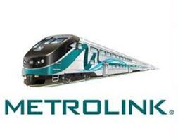
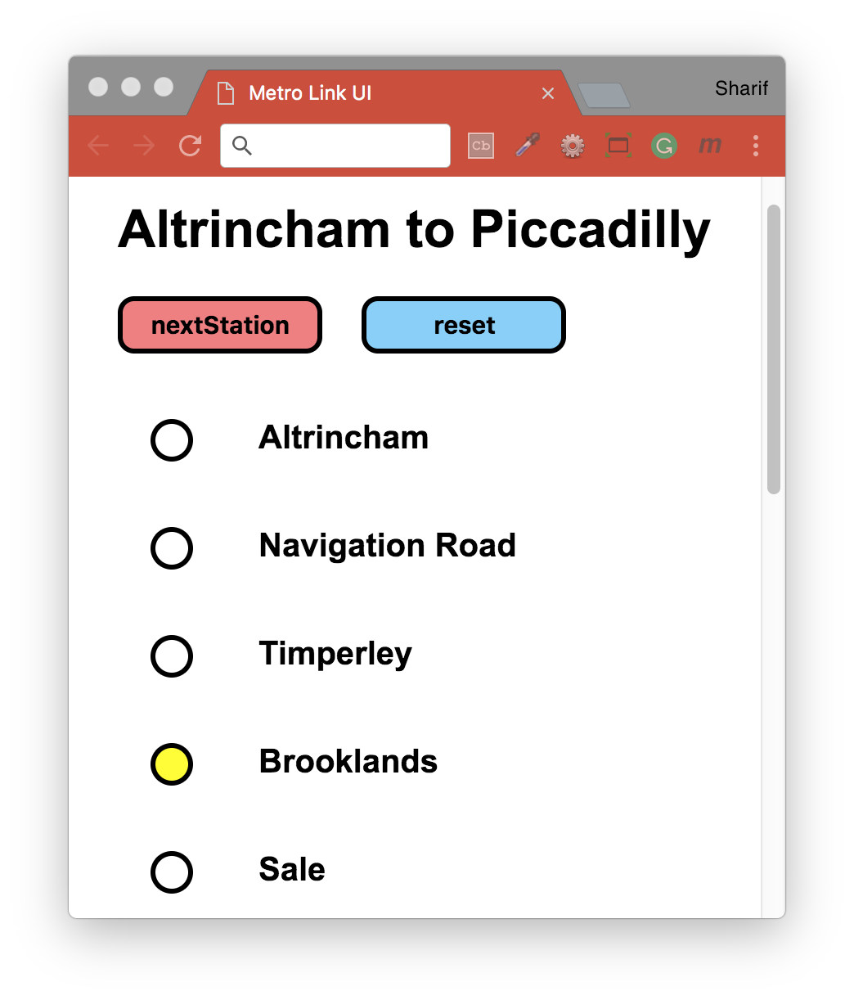

# Metrolink :train:
We’ll be making a basic object-oriented application that will be representative of the Metrolink tram network (probably not a very accurate representation!).

We will create 3 objects for our application: `Tram`, `Station` and `Route`. We will be able to create multiple instances of each object so we will need to use the Prototype/Constructor pattern. For now, we will refrain from showing our application’s state on the DOM - our application will be accessible from the browser console only. Our application flow will look something like this:

### Bonus - Metrolink GUI(Graphical User Interface)
Now we want to reflect those changes on the DOM. We're going to represent an entire Metrolink route on the page, and we will have a **Next Station** button, which moves us along the route.

